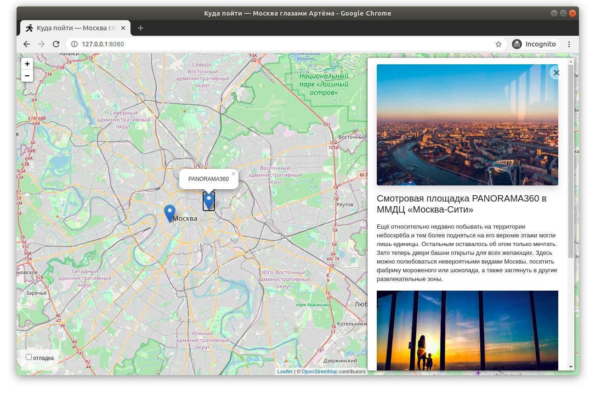
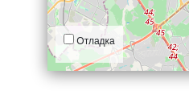

# Moscow Places - Интересные места Москвы

Бэкенд-часть для сайта о интересных местах Москвы. Проект предоставляет API для получения данных о местах и их отображения на карте.


[Демка сайта](https://devmanorg.github.io/where-to-go-frontend/).

## Особенности

- API для работы с местами
- Админ-панель Django для управления контентом
- Поддержка загрузки данных из JSON-файлов
- Оптимизированные запросы к базе данных
- Подробные модели данных с географическими координатами
- Python 3.10+
- Django 4.2
- TinyMCE для редактирования контента


## Установка и запуск

Клонируйте репозиторий:
```bash
git clone https://github.com/karaman56/Yandex
```

## Как запустить

* Скачайте код
* Создать и активировать виртуальное окружение:
* Установить зависимости
```bash
pip install -r requirements.txt
```
* Применить миграции
* Для загрузки данных из JSON файлов выполните: ```python manage.py load_place path/to/json_data/```
* Запустите сервер


В качестве веб-сервера можно использовать что угодно. Например, подойдёт даже самый простой встроенный в Python веб-сервер:

```bash
python manage.py runserver
```

Внизу справа на странице можно включить отладочный режим логгирования.




Если что-то работает не так, как ожидалось, то начните с включения отладочного режима логгирования.


```Структура JSON файла
{
  "title": "Название места",
  "description_short": "Краткое описание",
  "description_long": "Подробное описание",
  "coordinates": {
    "lng": 37.12345,
    "lat": 55.12345
  },
  "imgs": [
    "https://example.com/photo1.jpg",
    "https://example.com/photo2.jpg"
  ]
}
```

* `title` — название локации
* `placeId` — уникальный идентификатор локации, строка или число
* `detailsUrl` — адрес для скачивания доп. сведений о локации в JSON формате

Значение поля `placeId` может быть либо строкой, либо числом. Само значение не играет большой роли, важно лишь чтобы оно было уникальным. Фронтенд использует `placeId` чтобы избавиться от дубликатов — если у двух локаций одинаковый `placeId`, то значит это одно и то же место.


## Цели проекта

Код написан в учебных целях — это урок в курсе по Python и веб-разработке на сайте [Devman](https://dvmn.org).

Тестовые данные взяты с сайта [KudaGo](https://kudago.com).

