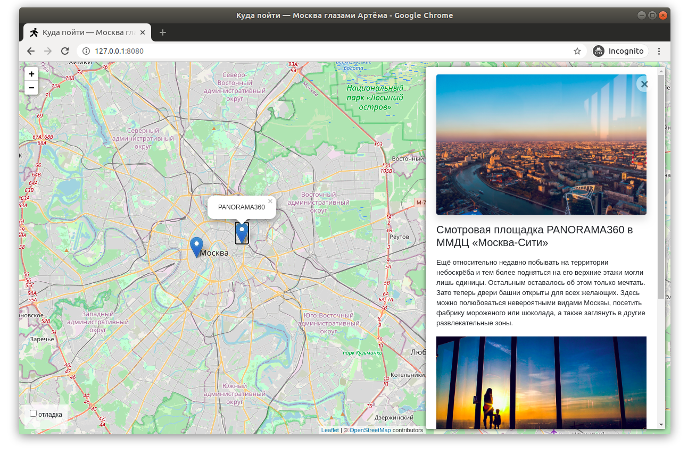

# Moscow Places - Интересные места Москвы

Бэкенд и фронтенд для сайта о самых интересных местах в Москве. Проект позволяет просматривать локации на карте и получать подробную информацию о каждом месте.



[Демка сайта](https://devmanorg.github.io/where-to-go-frontend/).

## Особенности

- Отображение мест на интерактивной карте (Leaflet.js)
- Подробная информация о каждом месте с фотогалереей
- Админка для управления контентом (Django Admin)
- Загрузка данных из JSON файлов


## Установка и запуск

Клонируйте репозиторий:
```bash
git clone https://github.com/karaman56/Yandex
```

## Как запустить

* Скачайте код
* Создать и активировать виртуальное окружение:
* Установить зависимости
* Применить миграции
* Для загрузки данных из JSON файлов выполните: ```python manage.py load_place path/to/json_data/```
* Запустите сервер

В качестве веб-сервера можно использовать что угодно. Например, подойдёт даже самый простой встроенный в Python веб-сервер:

```bash
$ python -m http.server 8000
```

Внизу справа на странице можно включить отладочный режим логгирования.


Настройки сохраняются в Local Storage браузера и не пропадают после обновления страницы. Чтобы сбросить настройки, удалите ключи из Local Storage с помощью Chrome Dev Tools —&gt; Вкладка Application —&gt; Local Storage.

Если что-то работает не так, как ожидалось, то начните с включения отладочного режима логгирования.

Фронтенд получает данные из JSON файлов

```Структура JSON файла
{
  "title": "Название места",
  "description_short": "Краткое описание",
  "description_long": "Подробное описание",
  "coordinates": {
    "lng": 37.12345,
    "lat": 55.12345
  },
  "imgs": [
    "https://example.com/photo1.jpg",
    "https://example.com/photo2.jpg"
  ]
}
```

* `title` — название локации
* `placeId` — уникальный идентификатор локации, строка или число
* `detailsUrl` — адрес для скачивания доп. сведений о локации в JSON формате

Значение поля `placeId` может быть либо строкой, либо числом. Само значение не играет большой роли, важно лишь чтобы оно было уникальным. Фронтенд использует `placeId` чтобы избавиться от дубликатов — если у двух локаций одинаковый `placeId`, то значит это одно и то же место.


## Используемые библиотеки

* [Leaflet](https://leafletjs.com/) — отрисовка карты
* [loglevel](https://www.npmjs.com/package/loglevel) для логгирования
* [Bootstrap](https://getbootstrap.com/) — CSS библиотека
* [Vue.js](https://ru.vuejs.org/) — реактивные шаблоны на фронтенде

## Цели проекта

Код написан в учебных целях — это урок в курсе по Python и веб-разработке на сайте [Devman](https://dvmn.org).

Тестовые данные взяты с сайта [KudaGo](https://kudago.com).

